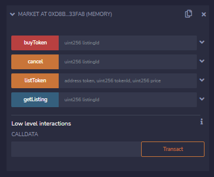

<h1>Đây là một dự án chợ NFT đơn giản</h1>

<h2>Các tính năng cơ bản gồm:</h2>
<ul>
  <li>Tạo ra NFT</li>
  <li>Đăng bán NFT trên Marketplace</li>
  <li>Thu hồi NFT đã đăng lên Marketplace</li>
  <li>Mua NFT trên Marketplace</li>
</ul>

<h2>Để chạy thử dự án ta có thể làm như sau: </h2>
<ul>
  <li>1. Truy cập IDE Remix online <a href="https://remix.ethereum.org/">link</a></li>
  <li>2. Thêm 2 file "market.sol" và "simple-NFT.sol" từ github</li>
  <li>3. Deloy 2 contract là Market và SimpleNFT</li>
  <li>4. Tạo NFT</li>
  <ul>
    <li>1. Mint NFT bằng hàm mint trong SimpleNFT</li>
    <li>2. Lấy address của NFT và địa chỉ ví NFT</li>
  </ul>
  <li>5. Đăng bán NFT</li>
  <ul>
    <li>1. Đăng bán NFT bằng hàm listToken trong Market</li>
    <li>2. Chú ý dùng ví đã tạo NFT để đăng bán</li>
    <li>3. Sau khi đăng bán sẽ bị không thành công, lỗi "ERC721: transfer caller is not owner nor approved"</li>
    <li>4. Lúc này cần cấp quyền cho chợ bằng hàm "approve" của SimpleNFT</li>
    <li>4. Sau khi cấp quyền xong trở lại và đăng bán</li>
  </ul>
  <li>6. Có thể dùng 1 ví khác và cấp value đủ để mua NFT, hoặc gỡ NFT khỏi chợ</li>
  <li>7. Để test bước 6, có thể xem chủ sở hữu NFT bằng hàm "ownerOf" trong SimpleNFT</li>
</ul>

<h2>Các Contract của dự án</h2>
<h4>Simple NFT Contract</h4>

